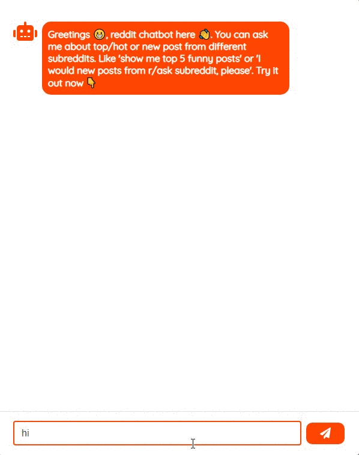
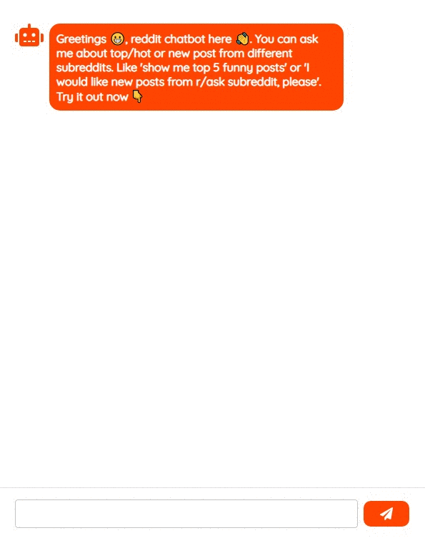

# dialogflow-reddit-chatbot (Server Side)
A dailogflow chatbot that consumes the reddit api using a flask server and a react js client.
Simply ask a question like "**Get me the top 3 reddit posts from r/ProgrammerHumor**" and the chatbot will respond with posts queried from Reddit.

Demo 1 | Demo 2
------------ | ------------- 
 | 

# Table of Contents
- [Built With](#built-with)
- [Usage](#usage)
- [Support](#support)
- [License](#license)

## Built-With
### Server Side
- [Flask](https://flask.palletsprojects.com/en/1.1.x/)
- [Dialogflow](https://cloud.google.com/dialogflow/?utm_source=google&utm_medium=cpc&utm_campaign=emea-emea-all-en-dr-skws-all-all-trial-p-gcp-1011340&utm_content=text-ad-none-any-DEV_c-CRE_550162822986-ADGP_Hybrid%20%7C%20SKWS%20-%20PHR%20%7C%20Txt%20~%20AI%20%26%20ML%20~%20Dialogflow%23v3-KWID_43700066772651217-aud-488003287395%3Akwd-389521182622-userloc_9076828&utm_term=KW_dialogflow-NET_g-PLAC_&gclid=Cj0KCQiAzeSdBhC4ARIsACj36uF6zxdWzxvsFPqTKmusbtAQFAR2C4m4aWQ_IUrjwzPAohr-dFFaWaUaApLnEALw_wcB&gclsrc=aw.ds)
### Client Side
- [React](https://reactjs.org/)
- [Redux](https://redux.js.org/)
- [React-Redux](https://react-redux.js.org/)
- [Axios](https://github.com/axios/axios)
- [React Materail UI](https://material-ui.com/)
- [AnimeJS](https://animejs.com/)

## Usage

### Using Docker


### Running both Server and Client Side separately

To run the server side, check the `flask-server` folder and follow instructions from the README.md file. Same for the Client side, open the `react-js-client` folder.

## Support

Reach out to me at one of the following places!

- Email at jama3137@gmail.com
- Twitter [timedjama5262](https://twitter.com/timedjama5262)

## License

```
MIT License

Copyright (c) 2020 Jama Mohamed

Permission is hereby granted, free of charge, to any person obtaining a copy
of this software and associated documentation files (the "Software"), to deal
in the Software without restriction, including without limitation the rights
to use, copy, modify, merge, publish, distribute, sublicense, and/or sell
copies of the Software, and to permit persons to whom the Software is
furnished to do so, subject to the following conditions:

The above copyright notice and this permission notice shall be included in all
copies or substantial portions of the Software.

THE SOFTWARE IS PROVIDED "AS IS", WITHOUT WARRANTY OF ANY KIND, EXPRESS OR
IMPLIED, INCLUDING BUT NOT LIMITED TO THE WARRANTIES OF MERCHANTABILITY,
FITNESS FOR A PARTICULAR PURPOSE AND NONINFRINGEMENT. IN NO EVENT SHALL THE
AUTHORS OR COPYRIGHT HOLDERS BE LIABLE FOR ANY CLAIM, DAMAGES OR OTHER
LIABILITY, WHETHER IN AN ACTION OF CONTRACT, TORT OR OTHERWISE, ARISING FROM,
OUT OF OR IN CONNECTION WITH THE SOFTWARE OR THE USE OR OTHER DEALINGS IN THE
SOFTWARE.
```