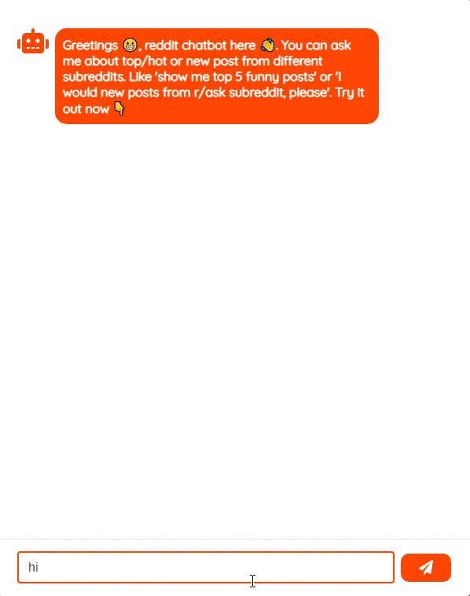
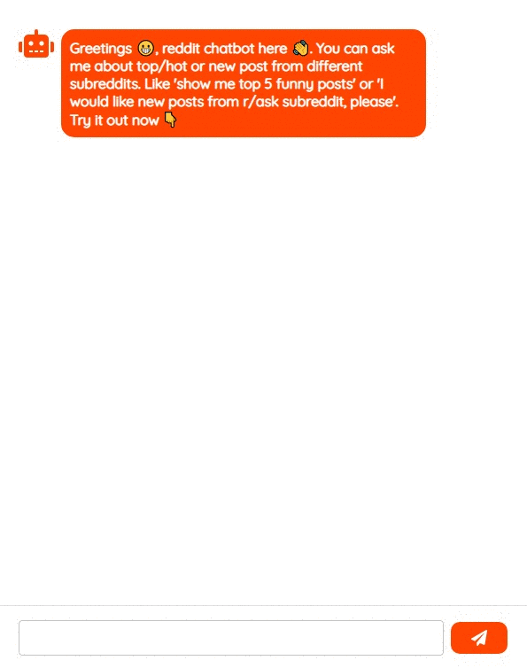

# dialogflow-reddit-chatbot (Client Side)
A dailogflow chatbot that consumes the reddit api using a flask server-side and react client-side

## Original Designs can be found here
[Original Figma Designs](https://www.figma.com/file/0Uuh15ZmuEMxlKyLneLXYk/Dialogflow-Reddit-Chatbot?node-id=0%3A1) 🎨

Demo 1 | Demo 2
------------ | ------------- 
 | 

# Table of Contents
- [Built With](#built-with)
- [Installation](#installation)
- [Usage](#usage)

## Built-With

- [React](https://reactjs.org/)
- [Redux](https://redux.js.org/)
- [React-Redux](https://react-redux.js.org/)
- [Axios](https://github.com/axios/axios)
- [React Materail UI](https://material-ui.com/)
- [AnimeJS](https://animejs.com/)

## Installation

### Cloning
Clone this repo to your local machine using `https://github.com/jama5262/dialogflow-reddit-chatbot.git`

And switch change directory
```
cd react-js-client
```

### Installing all packages
After cloning `cd` into the project and run the following to install all packages
```
npm install
```
Great the project has been setup 👍

## Usage

The client-side will need the flask server-side's url that should be running. Create a`.env` file with the following content

```
REACT_APP_FLASK_SERVER_BASE_URL=http://localhost:5000
```

To start using it locally, run the following
```
npm start
```

You can find the app here http://localhost:3000

### Build the react client side and host from the flask server

You can also build the static file with the following command for the react client app. Once built, move these files to `flask-server/app/templates` and you can now load them from the `flask server`

```
npm run build
```